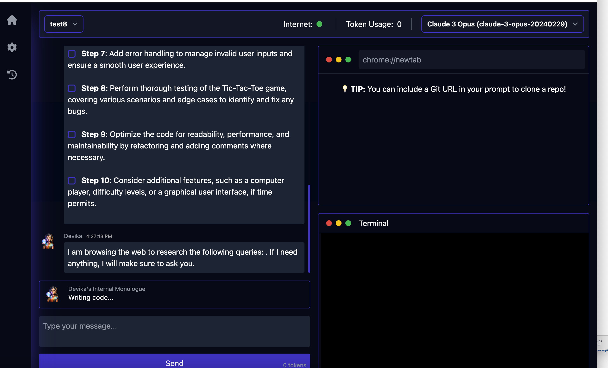
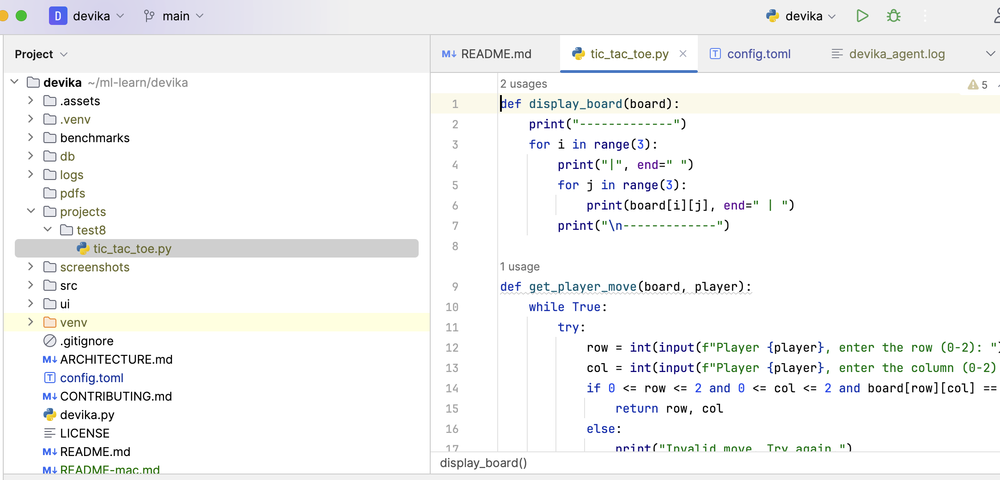
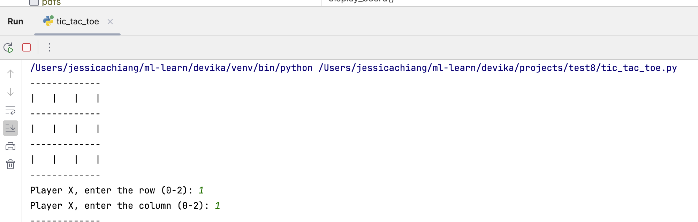
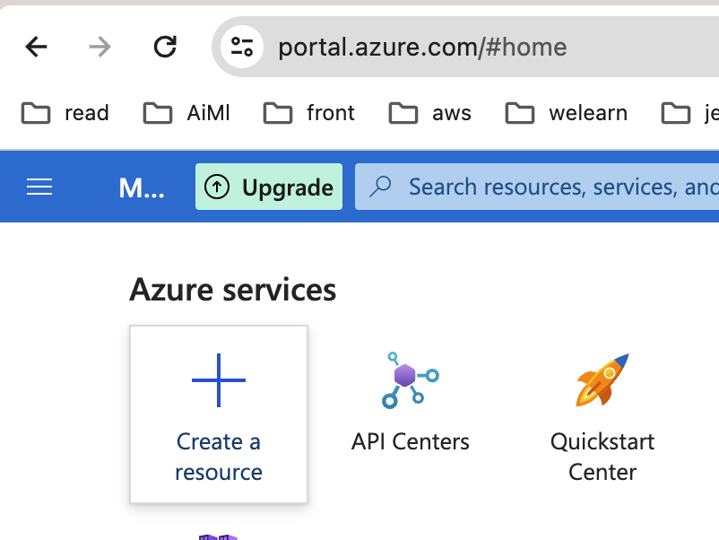
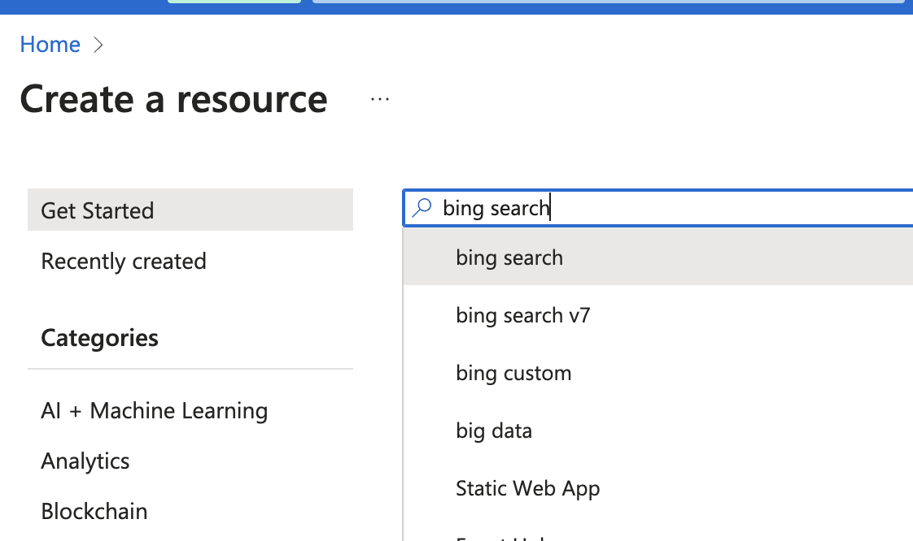
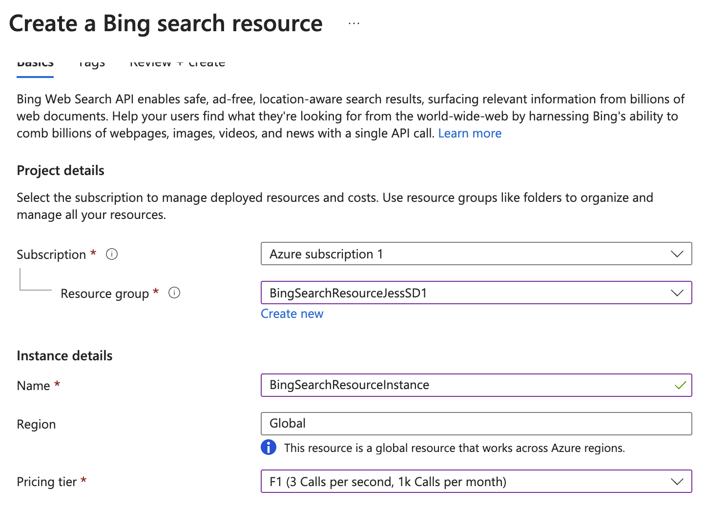
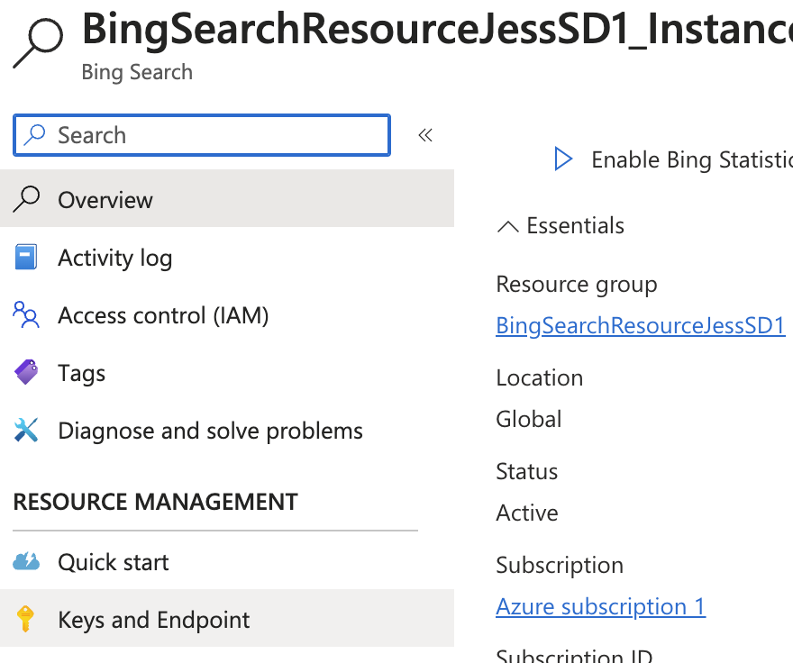
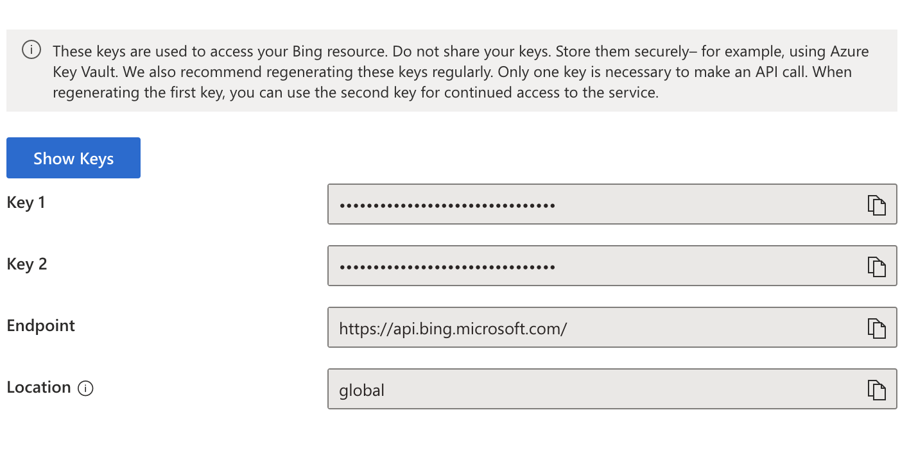

# Steps to get devika running locally


_Though I have tried the other models, but only Claud3 works for me (for now until updates become available) all the way
to code creation._ 


# Step 1: Install required software

## Install python

``` 
sudo apt-get install python3
```

## Install uv

[uv]((https://github.com/astral-sh/uv)) is an extremely fast python package manager, written in Rust.

``` 
curl -LsSf https://astral.sh/uv/install.sh | sh
pip install uv
```

## Install bun
[bun](https://bun.sh/) is a fast JavaScript package manager

To install:
``` 
curl -fsSL https://bun.sh/install | bash
```

## Install and run Ollama
[ollama](https://ollama.com/) is advanced AI tool that allows users to easily set up and run LLMs locally.

# Set up Devika Project

Clone the devika project 
``` 
git clone https://github.com/stitionai/devika
```

Then cd into devika directory
``` 
cd devika
```
Setup python virtual environment and install required packages 
``` 
uv venv
uv pip install -r requirements.txt
```
Then install [playwright](https://playwright.dev/), which is a tool that supports end-to-end webapp test.
``` 
playwright install --with-deps
```

Run bun to install required JavaScript packages
```
cd ui/
bun install
```
The final step is to update the config.toml, which contains API keys. I left the STORAGE configuration
items unchanged and just update the API_KEYS. PS I did not set up Netlify.
``` 
[STORAGE]
SQLITE_DB = "db/devika.db"
SCREENSHOTS_DIR = "screenshots"
PDFS_DIR = "pdfs"
PROJECTS_DIR = "projects"
LOGS_DIR = "logs"
REPOS_DIR = "repos"

[API_KEYS]
BING = "<BING_SERACH_API_KEY>"
CLAUDE = "<CLAUD_API_KEY>"
NETLIFY = "<YOUR_NETLIFY_API_KEY>"
OPENAI = "<OPEN_API_KEY>"

[API_ENDPOINTS]
BING = "https://api.bing.microsoft.com/v7.0/search"
```


To start running ollama, open a terminal and runs:
``` 
ollama serve
```
Then open another terminal 
``` 
cd devika
cd ui
bun run dev
```
Then open another terminal to run devika
``` 
python devika.py
```
Now you can hit `localhost:3000` to test out the app
I just follow the Devika instruction 
[Getting-Started](https://github.com/stitionai/devika?tab=readme-ov-file#getting-started)







# Additional Info 
## Get Bing Search API Key 
### Sign up an Azure account (if not already)
Go to https://portal.azure.com/#home and this would require you "authenticate" yourselve, including adding a valid 
credit card, so buyers be aware. 
Login to your Azure portal and add a new resource



Then type "Bing Search" to find Bing Search Resources, then select Bing Search v7




Below is the options I gave to create my Bing Search Resource  



Once the resource is created, you can click on `Keys and Endpoint` to find the API Keys




Then you can view the Bing Search API Keys



To verify that the key works
``` 
curl -X GET 'https://api.bing.microsoft.com/v7.0/search?q=Microsoft' \
-H 'Ocp-Apim-Subscription-Key: <BING_SEARCH_API_KEY>'
```

## Get Claude Key

Create an Anthropic account at https://www.anthropic.com/ and go to https://console.anthropic.com/dashboard

# Helpful Resources (for me)
The discord server is pretty helpful and that's where I found answers to most of my questions.

Learn more about it and join it using this [link](https://github.com/stitionai/devika?tab=readme-ov-file#community-discord-server)